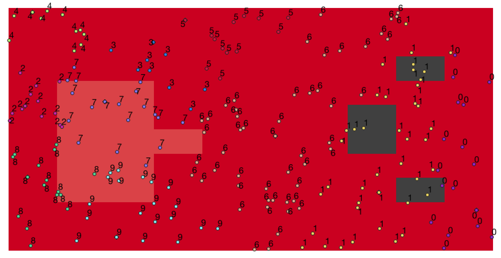
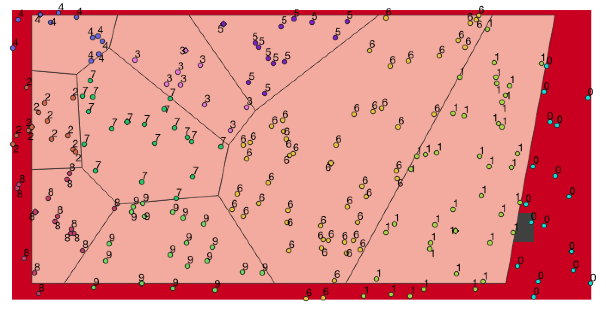
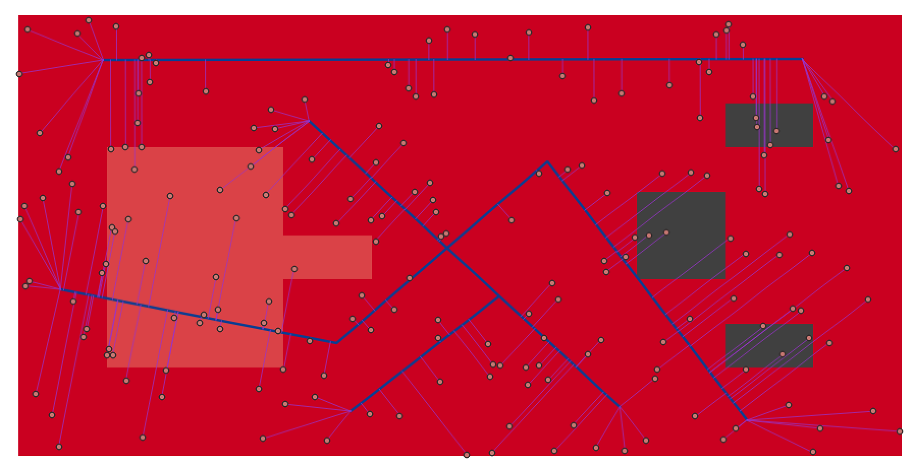
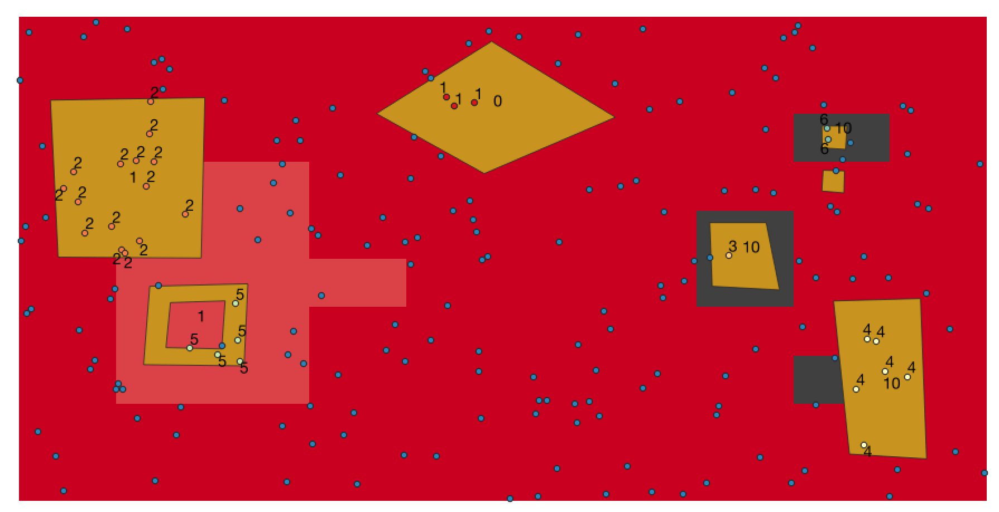
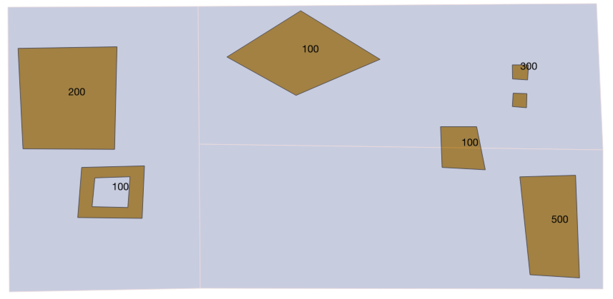
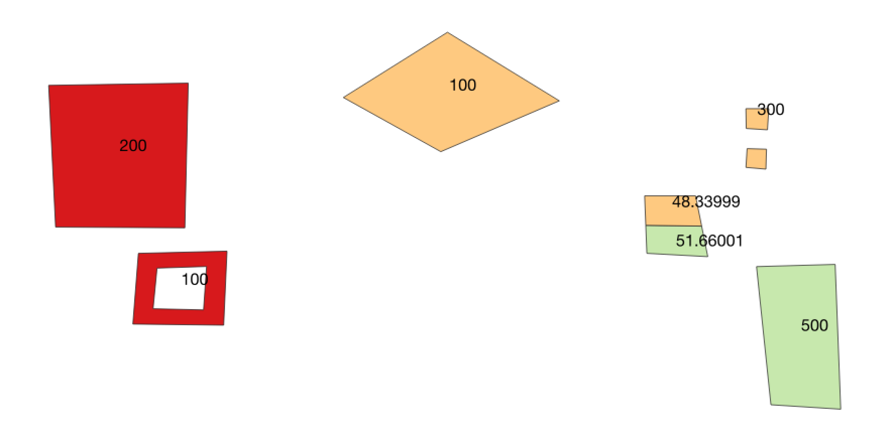
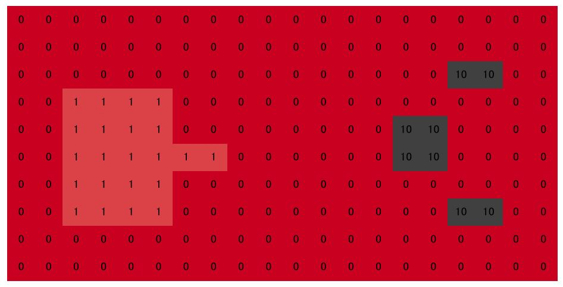
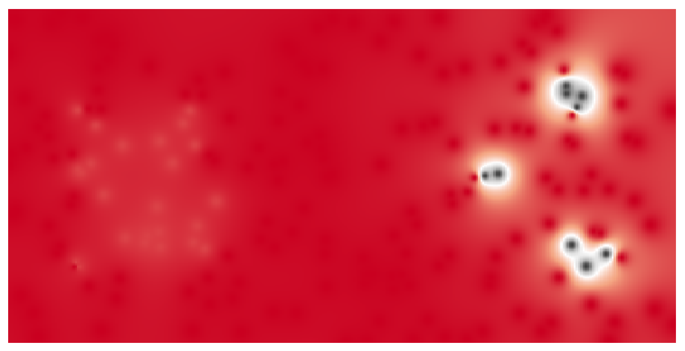
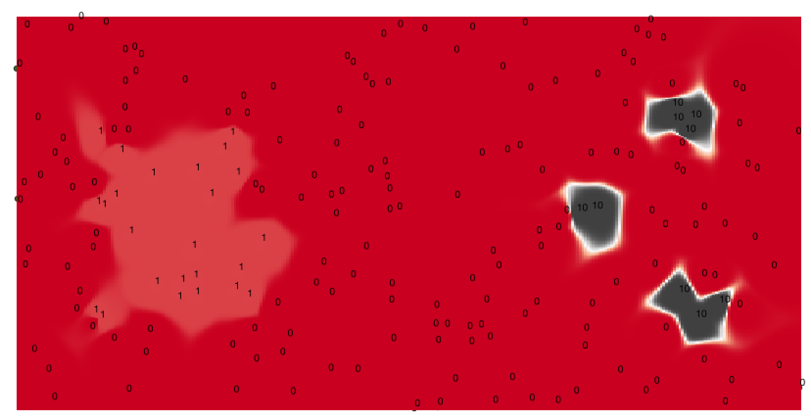

## Practical use of GDAL/QGIS3

空間データの相互関係を扱う、主な計算処理は以下の通り。
なお、面積や距離を計算する場合、使用するデータのCRSをメートル単位などに変換しておく必要がある。
また、ラスターを微細なベクターに変換したり（QGISではラスタ▶︎変換▶︎ポリゴン化）、線データを微細なセグメントに分解したり（GRASSのv.split）、点・線データからバッファーを作る（ベクタ▶︎空間演算ツール▶︎可変距離バッファ）など、形式を横断する工夫が必要になる場合もある。

### Point vs Point
レイヤーAの点を、最寄りの点（レイヤーB）によって分類したり、その距離を計算する操作などがあたる。

基本はQGISのベクタ▶︎解析ツール▶距離マトリックスを使用する。MultiPointにも対応している。︎
以下は、200点を(random200.shp)を別の点ファイル(random10.png)に対する最近傍であることを基準に分類した例。

ベクタ▶︎ジオメトリツール▶ボロノイポリゴンで最近傍領域のポリゴンを作ることができる。
MultiPointには対応しない（マルチパートを分解して使用し、後で結合すればいよい）。︎

最近傍距離分析は、点がクラスター化しているか、綺麗に分散しているかの統計的検定。
[ESRIの説明](http://desktop.arcgis.com/ja/arcmap/10.3/tools/spatial-statistics-toolbox/average-nearest-neighbor.htm)が非常に詳しい。

### Point vs Line
レイヤーAの点を、最寄りの線（レイヤーB）によって分類し、距離を測る。地価データの沿線別集計などがあたる。

GRASSのv.distanceが最寄りの線と垂線を作る。v.distanceはPoint同士やPolygonも処理できる。
詳しくは[GRASSの説明](https://grass.osgeo.org/grass75/manuals/v.distance.html#find-nearest-lines)がある。
Mac版QGIS3ではGRASSが動かない場合がある。

以下は、200点を(random200.shp)を別の線ファイル(testLines.shp)に対する最近傍であることを基準に分類した例(nearestLinesDistances.shp)。

### Point vs Polygon
レイヤーAの点を、ポリゴン（レイヤーB）によって分類する。

点データに、所属するポリゴンの情報を結びつける空間結合（Spatial join）。QGISのベクタ▶︎データ管理ツール▶︎属性の結合(Join attributes by location)で処理できる。点データ(random200.shp)にポリゴン(testPolygons.shp)のidが付加される。

### Line vs Polygon

QGISのベクタ▶︎空間演算ツール▶︎クリップで、Polygonと重なる部分だけのLineが得られる。
PolygonをLineに変換し、プロセッシングツールのベクタオーバーレイ▶︎ラインで分割を使うと、線をポリゴンで分割できる。

### Polygon vs Polygon

レイヤーAのポリゴンを、ポリゴン（レイヤーB）によって分類し、集計する例。

QGISのベクタ▶︎空間演算ツール▶︎交差で、Polygonファイル(testPolygons.shp)をPolygonファイル(testPolygons2.shp)で切断すると、切断されてどのPolygonに包含されたかの情報が不可される(intersections.shp)。

切断前の面積と切断後の面積の比率でデータを比例配分すると、集計ができる。

### Point vs Raster
レイヤーAの点に、ラスター（レイヤーB）の値を付与する。

#### 点の直下のラスター値をテーブルに格納する

以下のようなラスター(testRaster32.tif)があるとする。

点データ(random200.shp)に、直下のラスターデータを付加したい場合、QGISのプラグインでPoint Sampling Toolを使う。

#### ラスター値を内挿してテーブルに格納する

（動いていない）
QGIS3のプロセッシングでSAGAのAdd Grid Values to Pointsが直接使えればよいのだが、インターフェースが更新されていないため、現状では使用できない。このため、コマンドラインから直接SAGAを使用する。
Windowsの場合、コマンドプロンプトからパスを設定し、saga_cmdを叩く。
SAGAはシェイプファイルを理解するが、GeoTiffは理解しない。QGISでSAGAフォーマットに変換しておく必要がある。
::

set SAGA=C:¥Program Files¥QGIS 3.0¥apps¥saga-ltr
set SAGA_MLB=C:¥Program Files¥QGIS 3.0¥apps¥saga-ltr¥modules
cd C:¥Program Files¥QGIS 3.0¥apps¥saga-ltr
saga_cmd shapes_grid "Add Grid Values to Points"
 -SHAPES "C:/Users/isao/Desktop/PracticalGIS/testData/grid.shp"
 -GRIDS "C:/Users/isao/Desktop/PracticalGIS/testData/testRaster.sgrd"
 -RESAMPLING 0
 -RESULT "C:/Users/isao/Desktop/PracticalGIS/testData/gridValue0.shp"

RESAMPLINGで内挿方法を指定できる。詳しくは[SAGAの説明](https://sourceforge.net/p/saga-gis/wiki/Executing%20Modules%20with%20SAGA%20CMD/)を参照。

#### DEMラスターで二次元SHPを三次元SHPに変換する

QGISのGRASSにあるv.drapeを使う。変換後のジオメトリはPoint25D（Z値付き）になる。ラスターは32ビットが想定されている。

#### Pointデータからラスターを内挿する（Kriging）

QGIS2.18ではラスタ▶︎解析▶︎グリッド（補間）で、逆距離、移動平均、最近傍などの補間ができる。プラグインのRaster Interpolationもあるが、Krigingはない。
QGIS3のプロセッシング▶︎ツールボックスで、IDW補完を選ぶと逆距離加重（IDW）と不規則三角ネットワーク（TIN）が使用できる。

IDWで重みを2にした場合は以下のようになる。

IDWで重みを10にした場合は以下のようになる。

KrigingはSAGAを使うことになっている（が、うまく動かない）。Windowsで直接[SAGAを立ち上げて、実行するほうが確実](https://gis-oer.github.io/gitbook/book/GIS%E3%82%AA%E3%83%BC%E3%83%97%E3%83%B3%E6%95%99%E6%9D%90/18_%E7%A9%BA%E9%96%93%E8%A3%9C%E9%96%93/%E7%A9%BA%E9%96%93%E8%A3%9C%E9%96%93.html#%E3%82%AF%E3%83%AA%E3%82%AE%E3%83%B3%E3%82%B0)。

Krigingが使えるのは、

1. 正規分布であること＝Histogramで確認できる
2. stationayであること＝分散がどこでも同じであること＝劇的に変化する分布では使えない（Empirical Bayesian Krigingなら可）
3. トレンドがないこと

であり、これらの点を検討せずKrigingを使うのはまずい。実際にも上手く内挿されないだろう。

### Line vs Raster

レイヤーAの線に、ラスター（レイヤーB）の集計値を付与する。ラスターが傾斜など移動コストを表す場合や、標高データ(DEM)で沿線の平均標高を求める場合にあたる。

### Polygon vs Raster
レイヤーAのポリゴンに、ラスター（レイヤーB）の集計値を付与する。ラスターが雨量や耕作地を表し、市町村ポリゴン別に集計する場合などがあたる。

QGIS2.18にはZonal Statistics Pluginがあり、各ポリゴンでラスター値の合計、最大、平均などを集計できる。
QGIS3では正式に統合され、プロセッシング▶︎ツールボックスで地域統計を選ぶ。

QGISのZonal Statisticsのアルゴリズムは以下の通り。

	もし、中心がポリゴンの内部に含まれるセル（ラスター）が１つしかない場合、すべてのセルをベクター化して、ポリゴンとの交差を計算し、面積比によってウエイトを決める。中心がポリゴン内部に２つ以上ある場合、そのポリゴンだけをウエイトを1とし、それ以外のウエイトを0とする。
	sumはウエイト付きの合計、countはウエイトの合計、meanはsumをcountで割ったもの、median、variance、maxなどはウエイトが0より大きいものだけを採用する。計算でウエイトは考慮しない。
	つまり、ラスターの粒度が十分細かいことが想定されている。

## 実際例

### 地価データの沿線別上昇率
### 原子力発電所の10キロ圏内人口
### 市町村別の樹木面積比率
### マラソンコースの凹凸
